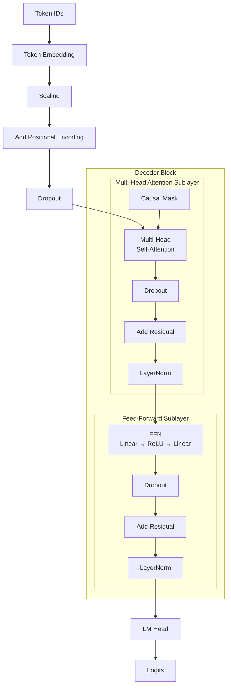

```mermaid
flowchart TD

    A["Token IDs"] --> B["Token Embedding"]
    B --> C["Scaling"]
    C --> D["Add Positional Encoding"]
    D --> E["Dropout"]

    E --> F

    subgraph BLOCK["Decoder Block"]
        direction TB

        subgraph ATTENTION["Multi-Head Attention Sublayer"]
            direction TB

            MASK["Causal Mask"] --> F
            F["Multi-Head<br/>Self-Attention"]
            F --> G["Dropout"]
            G --> H["Add Residual"]
            H --> I["LayerNorm"]
        end

        subgraph FFN["Feed-Forward Sublayer"]
            direction TB

            J["FFN<br/><span style='white-space:nowrap'>Linear → ReLU → Linear</span>"]
            J --> K["Dropout"]
            K --> L["Add Residual"]
            L --> M["LayerNorm"]
        end

        I --> J
    end

    M --> N["LM Head"]
    N --> O["Logits"]
```
